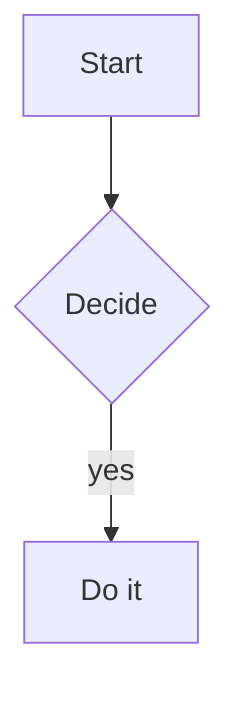

# Demo Preview

A paragraph with **bold** text and a [relative link](other.md).

## Code

```rust
fn main() {
    println!("hello");
}
```

## Diagram



## Table

| Name | Value |
|------|-------|
| a    | 1     |

- [ ] todo item
- [x] done item
