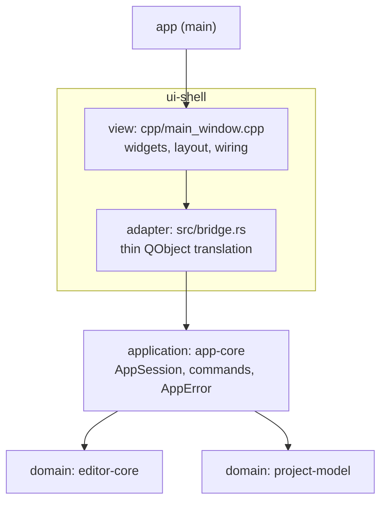

# Layering rules

Binding target architecture per [ADR-0002](decisions/0002-application-layer-and-humble-view.md) and [ADR-0003](decisions/0003-ffi-conventions.md).
Hexagonal-lite with a humble Qt view: logic in Qt-free Rust, the view only displays and forwards intent.

## Layers



## Allowed imports

| Crate | May depend on | Qt/cxx-qt allowed |
|-------|---------------|-------------------|
| `editor-core` | (std only) | **No** |
| `project-model` | (std, notify) | **No** |
| `app-core` | `editor-core`, `project-model` | **No** |
| `ui-shell` | `app-core`, `editor-core`, `project-model` | Yes (adapter + view live here) |
| `app` | `ui-shell` | Yes |

`editor-core`, `project-model`, and `app-core` MUST NOT depend on cxx-qt or Qt in any form — no direct dependency, no transitive dependency, no feature-gated dependency.

## Where logic may live

- **Business rules and orchestration** (open rules, path construction, delete/rename → tab policy, watcher policy, dirty tracking): only in the Qt-free crates, normally `app-core`.
- **`bridge.rs` (adapter)**: translation only — QString/QModelIndex ↔ Rust types, session call, emit signal, refresh model. No domain state, no rules, no branching beyond type mapping.
- **`cpp/` (view)**: widget construction, layout, menus, dialogs, signal wiring only. It may ask "what happened" and show the answer; it never decides "what should happen".

Rule of thumb: if it deserves a unit test, it cannot live in `bridge.rs` or `cpp/`.

## FFI seam rules

Summary of [ADR-0003](decisions/0003-ffi-conventions.md):

- Errors cross as a typed struct: stable `i32` code (0 = success) + display message. Never a `QString` sentinel.
- Tabs are identified by `TabId(u64)` issued by `app-core`; index mapping exists only at the Qt tab-strip/model edge.
- Rust `Document` is the single source of truth for dirty state; `QTextDocument` forwards edits, the view reads flags.

## UI framework

The view is Qt Widgets today.
QML is the planned future view.
View-swappability is therefore a hard requirement, not a nice-to-have — the humble-view split above is what guarantees it, because a view containing zero rules can be replaced without touching `app-core` or the domain crates.

## Verification

```sh
cargo test --workspace
cargo tree -p editor-core -e normal | grep -i qt    # must be empty
cargo tree -p project-model -e normal | grep -i qt  # must be empty
cargo tree -p app-core -e normal | grep -i qt       # must be empty
```

## Known debt at time of writing

`app-core` does not exist yet; the refactoring phase creates it.
Until then, the following violations of this document are known debt being removed:

- Business rules in the view: binary-open rule (`main_window.cpp:283-306`), rename path construction (`377-383`), delete orchestration (`399-404`).
- QObjects owning domain state: `ProjectSession` in `bridge.rs:401`, `TabList` in `bridge.rs:667`.
- `QString` sentinel errors, int-index tab identity, and dual dirty state across the FFI seam (see ADR-0003).

Trigger to pay down: the refactoring phase of the current architecture plan; no new code may extend these patterns in the meantime.
