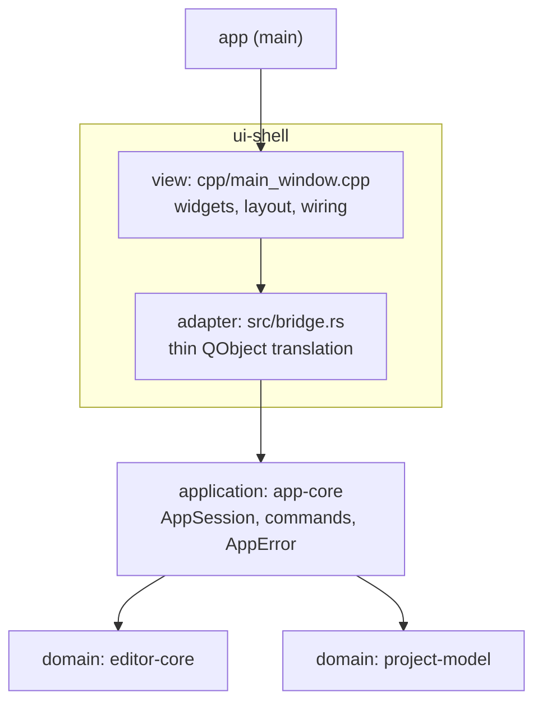

# Layering rules

Binding target architecture per [ADR-0002](decisions/0002-application-layer-and-humble-view.md) and [ADR-0003](decisions/0003-ffi-conventions.md).
Hexagonal-lite with a humble Qt view: logic in Qt-free Rust, the view only displays and forwards intent.

## Layers



## Allowed imports

| Crate | May depend on | Qt/cxx-qt allowed |
|-------|---------------|-------------------|
| `editor-core` | (std, ropey, regex) | **No** |
| `project-model` | (std, notify) | **No** |
| `syntax-core` | (std, tree-sitter, tree-sitter-rust, tree-sitter-json, tree-sitter-c-sharp, tree-sitter-java, tree-sitter-php, streaming-iterator) | **No** |
| `app-config` | (std, dirs, serde, toml, nucleo-matcher) | **No** |
| `mcp-server` | `index-core`, `editor-core` (+ std, serde, serde_json, tokio, axum) | **No** |
| `pty-core` | (std, portable-pty) | **No** |
| `terminal-core` | (std, alacritty_terminal) | **No** |
| `lsp-core` | (std, lsp-types, serde, serde_json; `syntax-core` as a **dev**-dependency only, ADR-0018) | **No** |
| `index-core` | `syntax-core`, `editor-core` (+ std, tantivy, grep-searcher, grep-regex, grep-matcher, ignore, nucleo-matcher) | **No** |
| `settings-model` | `app-config`, `syntax-core`, `lsp-core` (+ std, serde, toml, tree-sitter) | **No** |
| `app-core` | `editor-core`, `project-model` | **No** |
| `ui-shell` | `app-core`, `editor-core`, `project-model`, `app-config`, `settings-model`, `syntax-core`, `mcp-server`, `index-core`, `lsp-core`, `pty-core`, `terminal-core` | Yes (adapter + view live here) |
| `app` | `ui-shell` | Yes |

`editor-core`, `project-model`, and `app-core` MUST NOT depend on cxx-qt or Qt in any form — no direct dependency, no transitive dependency, no feature-gated dependency.

## Where logic may live

- **Business rules and orchestration** (open rules, path construction, delete/rename → tab policy, watcher policy, dirty tracking, jump history): only in the Qt-free crates, normally `app-core`.
- **Rules that need the project index** (which declaration a caret resolves to, ADR-0011's local-file-then-project ranking; expanding a replacement against a matched span) live in `index-core`, not `app-core`: `app-core` may not depend on `index-core`. They are still Qt-free and unit-tested like any other rule.
- **Rules a refactoring needs** (which documents of a workspace edit are spliced in a buffer and which are written to disk, whether an answer is still fresh enough to apply, whether an inbound `workspace/applyEdit` was asked for, and whether a name-based rename site can be vouched for) live in `lsp-core` and `index-core` (ADR-0019).
  The adapter routes and the view paints; neither decides. In particular `bridge.rs` never re-derives which pile an edit belongs to — it forwards the flag `lsp_core::plan_edit` set.
- **Rules a settings page needs** (which override a colour row comes from, what a language load failure means in English, which server entries are worth persisting) live in `settings-model`, not in `app-config`: they join persisted settings to the vocabularies of `syntax-core` and `lsp-core`, which `app-config` deliberately knows nothing about (ADR-0017).
- **Which language a file is** is answered in exactly one place, `syntax-core`'s registry (ADR-0018).
  `lsp-core` owns only what the protocol owns — the server command per language id, and the few ids LSP names differently from the grammar (`tsx` -> `typescriptreact`) — and `ui-shell` joins the two, which is translation and so allowed in the adapter.
  No crate may grow a second file-extension table.
- **The index instance** is built and updated by `ui-shell`'s `SearchModel` and shared with `mcp-server` as an `Arc<RwLock<IndexSlot>>` (ADR-0012). `mcp-server` only queries it; it never builds or owns one.
- **`bridge.rs` (adapter)**: translation only — QString/QModelIndex ↔ Rust types, session call, emit signal, refresh model. No domain state, no rules, no branching beyond type mapping.
- **`cpp/` (view)**: widget construction, layout, menus, dialogs, signal wiring only. It may ask "what happened" and show the answer; it never decides "what should happen".

Rule of thumb: if it deserves a unit test, it cannot live in `bridge.rs` or `cpp/`.

## FFI seam rules

Summary of [ADR-0003](decisions/0003-ffi-conventions.md):

- Errors cross as a typed struct: stable `i32` code (0 = success) + display message. Never a `QString` sentinel.
- Tabs are identified by `TabId(u64)` issued by `app-core`; index mapping exists only at the Qt tab-strip/model edge.
- Rust `Document` is the single source of truth for dirty state; `QTextDocument` forwards edits, the view reads flags.

## UI framework

The view is Qt Widgets today.
QML is the planned future view.
View-swappability is therefore a hard requirement, not a nice-to-have — the humble-view split above is what guarantees it, because a view containing zero rules can be replaced without touching `app-core` or the domain crates.

## Verification

```sh
cargo test --workspace
cargo tree -p editor-core -e normal | grep -i qt    # must be empty
cargo tree -p project-model -e normal | grep -i qt  # must be empty
cargo tree -p app-core -e normal | grep -i qt       # must be empty
cargo tree -p pty-core -e normal | grep -i qt       # must be empty
cargo tree -p pty-core -e normal | grep -i tokio    # must be empty
cargo tree -p terminal-core -e normal | grep -i qt    # must be empty
cargo tree -p terminal-core -e normal | grep -i tokio # must be empty
cargo tree -p app-config -e normal | grep -i qt     # must be empty
cargo tree -p index-core -e normal | grep -i qt     # must be empty
cargo tree -p index-core -e normal | grep -i tokio  # must be empty
cargo tree -p mcp-server -e normal | grep -i qt     # must be empty
cargo tree -p lsp-core -e normal | grep -i qt       # must be empty
cargo tree -p lsp-core -e normal | grep -i tokio    # must be empty
```

## Known debt at time of writing

None. The refactoring phase this document anticipated is complete:
`app-core` exists (`AppSession`, `TabId`, `AppError`), `bridge.rs` is a
thin adapter, and `main_window.cpp` is a humble view with no business
rules. `cargo test --workspace` passes for the three Qt-free crates and
`cargo tree` confirms no Qt leakage into any of them.

No new code may reintroduce `QString` sentinel errors, int-index tab
identity, or business rules in `bridge.rs`/`cpp/` — see the FFI seam
rules and "Where logic may live" above.
