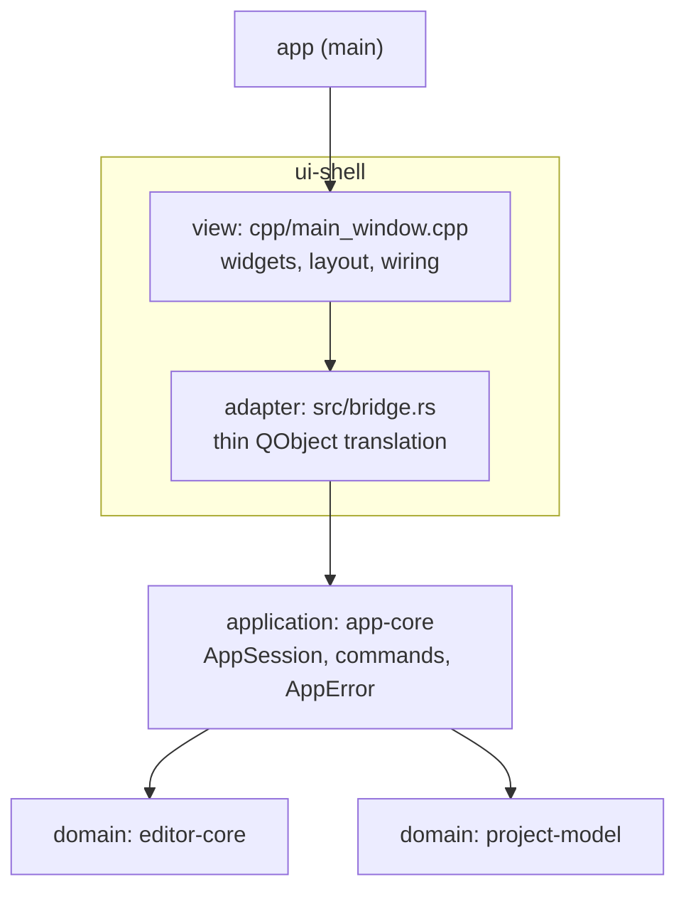

# Architecture overview

Arc42-lite overview of the current system.
The binding rules live in [layering.md](layering.md) and the ADRs; this page orients a new contributor.

## 1. Context

The project is an MVP IDE: a cross-platform text editor shell with a PHPStorm-like layout.
It is a Rust Cargo workspace with a Qt6 Widgets UI, bridged via `cxx-qt` per [ADR-0001](decisions/0001-core-tech-stack.md).
The MVP scope is open a folder, browse it in a sidebar tree, and edit/save text in tabs — see the [MVP proposal](../product/mvp-proposal.md).

## 2. Quality goals

1. **Testability without a display.**
   All business logic lives in Qt-free crates and runs under plain `cargo test`, with no Qt runtime or display server.
2. **View swappability.**
   The view is Qt Widgets today; QML is the planned future view.
   Because the view holds zero rules ([ADR-0002](decisions/0002-application-layer-and-humble-view.md)), swapping it must not touch `app-core` or the domain crates.
3. **Performance** (from ADR-0001): typing latency and large-file handling drive the Rust-core decision.

## 3. Building-block view

Four layers plus the binary crate, per [layering.md](layering.md):

| Crate | Layer | Responsibility | Qt |
|-------|-------|----------------|----|
| `editor-core` | domain | Rope-backed `Document`, tab list, load/save/dirty state | No |
| `project-model` | domain | `ProjectSession`, directory tree, `notify` watcher, last-project persistence | No |
| `app-core` | application | `AppSession`: orchestration, command methods, typed `AppError` | No |
| `ui-shell` | adapter + view | `src/bridge.rs`: cxx-qt QObject translation; `cpp/`: Widgets, layout, menus, dialogs, `QApplication` | Yes |
| `app` | main | Thin binary; hands off to `ui-shell` | Yes |

The view never decides, it only displays and forwards intent.
Rules crossing the FFI seam (typed errors, `TabId`, Rust-owned dirty state) are fixed by [ADR-0003](decisions/0003-ffi-conventions.md).

## 4. Cross-boundary communication

- UI actions call invokable slots on the `cxx-qt` QObjects; the adapter translates and delegates to `AppSession`.
- Rust-side changes (dirty flags, watcher events) surface as Qt signals; tree data is exposed via a `QAbstractItemModel` backed by Rust data.
- Filesystem watcher events arrive on a background thread and are marshalled onto the Qt event loop via `CxxQtThread` queuing — no shared-mutex model.

## 5. Build and deployment

`docker/Dockerfile` is a single multi-stage file: a `linux-builder` stage (apt Qt6) and a `windows-builder` stage cross-compiling with MXE's mingw-w64 + Qt6 toolchain.
Artifacts land in `dist/`.

## 6. Future scope (not implemented)

The following are documented direction per ADR-0001 but have no code and no crates today; add them when the work starts, not before:

- **LSP client** — language-server integration in the Rust core.
- **Debugger adapter (DAP)** — same placement rationale as LSP.
- **Plugin host** — hybrid model: native dylib loader (stable C ABI) for trusted, perf-critical integrations; sandboxed WASM runtime (wasmtime) with a narrower, capability-based API for third-party plugins.
- **QML view** — the planned replacement for the Widgets view; the humble-view split exists so this swap stays cheap.

Each of these gets its own ADR under `decisions/` when it becomes real.

## Related

- [Layering rules](layering.md) — binding dependency and logic-placement rules.
- [ADR-0001](decisions/0001-core-tech-stack.md), [ADR-0002](decisions/0002-application-layer-and-humble-view.md), [ADR-0003](decisions/0003-ffi-conventions.md).
- [MVP implementation plan](mvp-implementation-plan.md) — historical.
