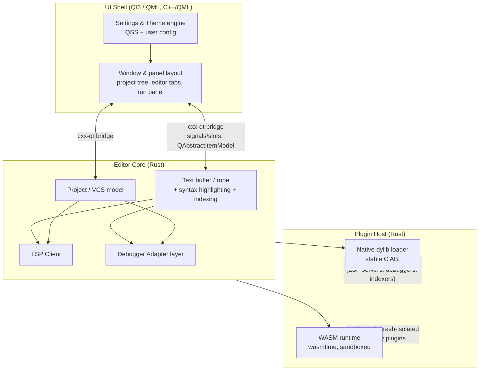

# Architecture overview

This describes the high-level module layout following
[ADR 0001: core tech stack](decisions/0001-core-tech-stack.md).
It is a sketch to orient contributors, not a full design spec — module-level
design docs and further ADRs will follow as implementation starts.

## Container diagram

## Modules

**UI Shell (Qt6/QML)**
Window chrome, panel layout (project tree, editor tabs, search results, run
console) — the PHPStorm-like layout the user asked for. Native widgets and
dialogs for OS-consistent look and feel. Lives in Qt/C++/QML because that's
where Qt's native rendering and theming live.

**Settings & Theme engine**
User configuration and QSS-based theming, feeding the UI Shell. Kept
alongside the UI layer since it's primarily about presentation.

**Editor Core (Rust)**
Text buffer/rope, syntax highlighting, and project indexing — the
performance-critical path (typing latency, large-file handling, whole-project
search). Written in Rust for speed and memory safety without GC pauses.

**LSP Client (Rust)**
Talks to language servers over the Language Server Protocol for
completions, diagnostics, go-to-definition, etc. Sits in the Rust core so it
can feed the buffer/indexing layer directly without crossing the UI FFI
boundary for every response.

**Debugger Adapter layer (Rust)**
Implements the Debug Adapter Protocol (DAP) to talk to language-specific
debuggers. Same rationale as the LSP client: perf- and latency-sensitive,
belongs in the Rust core.

**Project / VCS model (Rust)**
File-system project model and version control integration (diffing, status,
blame). Feeds both the UI (project tree, VCS gutter) and the indexing/LSP
layers.

**Plugin Host (Rust)**
Two loaders:
- *Native dylib loader*: stable C ABI, used for core/perf-critical
  integrations (bundled LSP/debugger adapters, custom indexers) that need
  full-speed, zero-copy access to the editor core.
- *WASM runtime (wasmtime)*: sandboxed, crash-isolated execution for
  third-party plugins, open to any language that compiles to WASM. The host
  API surface exposed to WASM plugins is intentionally smaller and
  explicitly versioned, since it's a trust boundary.

## Cross-boundary communication

The Rust core and Qt UI communicate via `cxx-qt` bindings:
- Rust-side state changes (buffer edits, indexing progress, VCS status)
  emit Qt signals the UI connects to.
- List/tree-shaped data (project tree, search results, run panel output)
  is exposed to Qt via `QAbstractItemModel` implementations backed by Rust
  data, avoiding a serialize/copy step for large result sets.
- UI actions (open file, run action, apply quick-fix) call into Rust slots
  through the same bridge.

## Plugin API surface

- **Native tier**: full access to editor core APIs (buffer mutation,
  indexing hooks, LSP/DAP integration points). Reserved for
  first-party/tightly-coupled integrations where trust is already implicit
  (they ship as dynamic libraries loaded into the host process).
- **WASM tier**: a deliberately narrower, capability-based API (read buffer
  contents, register commands/menu entries, contribute UI panels via
  declarative descriptions, make network requests only if granted). This is
  the extension point for the open third-party plugin ecosystem, sandboxed
  so a misbehaving or malicious plugin can't crash or compromise the host.

## Open follow-ups (not yet decided)

- Text buffer/rope data structure choice (e.g. `ropey` vs. custom).
- LSP client library choice (e.g. `tower-lsp` vs. custom).
- Build/packaging tooling: Cargo workspace layout + CMake integration for
  the Qt side, per-OS packaging (MSI/dmg/AppImage or similar).
- CI matrix covering Windows/macOS/Linux.

Each should get its own ADR under `decisions/` once decided.
