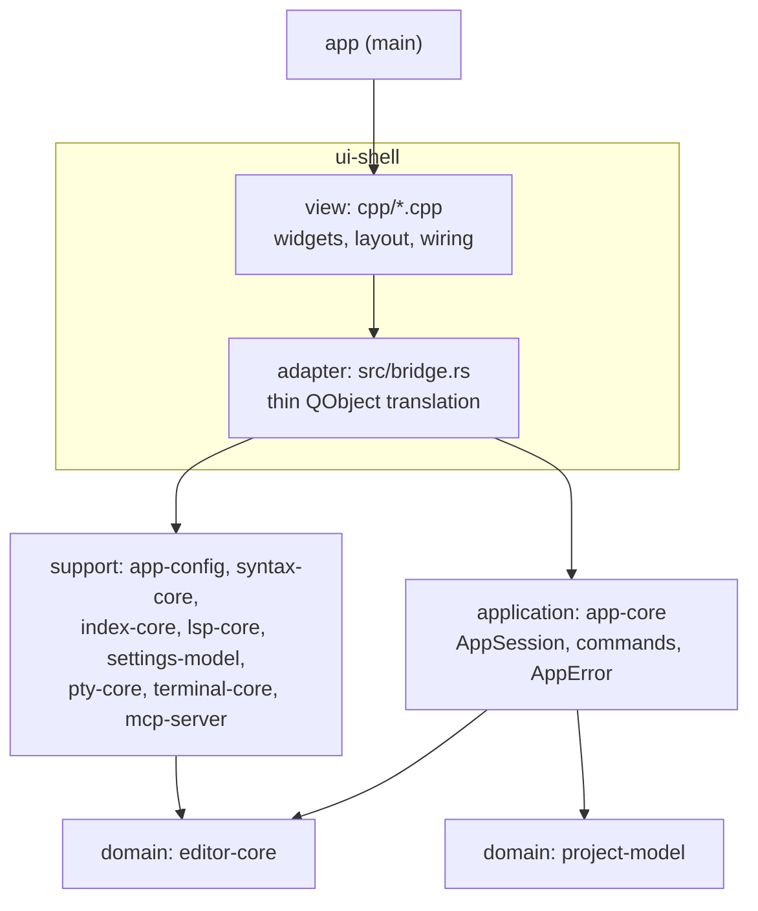

# Architecture overview

Arc42-lite overview of the current system.
The binding rules live in [layering.md](layering.md) and the ADRs; this page orients a new contributor.

## 1. Context

The project is a cross-platform IDE with a JetBrains-like layout.
It is a Rust Cargo workspace with a Qt6 Widgets UI, bridged via `cxx-qt` per [ADR-0001](decisions/0001-core-tech-stack.md).

It has grown past the original MVP (open a folder, browse a tree, edit and save tabs — see the [MVP proposal](../product/mvp-proposal.md)).
Shipped since: a settings window and keymap, ADS-based docking, theming, tree-sitter syntax highlighting and folding, a Class View outline, an embedded terminal, a project-wide text and symbol index, find and replace, code navigation (Go to Declaration, Find Usages, Go to Implementation, jump history), a language platform with 29 bundled tree-sitter grammar crates covering roughly 35 languages (see `crates/syntax-core/Cargo.toml`) and an LSP client, and refactoring (rename, Extract Method/Class through code actions).

## 2. Quality goals

1. **Testability without a display.**
   All business logic lives in Qt-free crates and runs under plain `cargo test`, with no Qt runtime or display server.
2. **View swappability.**
   The view is Qt Widgets today; QML is the planned future view.
   Because the view holds zero rules ([ADR-0002](decisions/0002-application-layer-and-humble-view.md)), swapping it must not touch `app-core` or the domain crates.
3. **Performance** (from ADR-0001): typing latency and large-file handling drive the Rust-core decision.

## 3. Building-block view

Four layers plus the binary crate, per [layering.md](layering.md).
Only `ui-shell` and `app` touch Qt; every other crate is Qt-free and unit-tested with no display.

| Crate | Layer | Responsibility | Qt |
|-------|-------|----------------|----|
| `editor-core` | domain | Rope-backed `Document`, tab list, load/save/dirty state, find/replace matching | No |
| `project-model` | domain | `ProjectSession`, directory tree, `notify` watcher, last-project persistence | No |
| `app-core` | application | `AppSession`: orchestration, command methods, typed `AppError`, jump history | No |
| `app-config` | support | `settings.toml` load/save, theme, editor font/colors, keymap | No |
| `syntax-core` | support | tree-sitter parsing: highlighting, folding, outline, occurrences, supertype edges | No |
| `index-core` | support | Project index: text search (tantivy + ripgrep crates) and symbols/references, plus declaration resolution ([ADR-0011](decisions/0011-code-navigation.md)) | No |
| `lsp-core` | support | LSP client: framing, supervised server processes, diagnostics, hover, navigation, completion, server catalog ([ADR-0016](decisions/0016-lsp-client.md)); code actions, rename and workspace edits ([ADR-0019](decisions/0019-lsp-refactoring.md)) | No |
| `settings-model` | support | The settings pages' rules: syntax-colour draft and override origin, language load errors as sentences, language-server draft ([ADR-0017](decisions/0017-settings-model-crate.md)) | No |
| `pty-core` | support | Cross-platform PTY transport for the embedded terminal | No |
| `terminal-core` | support | VT100/grid state over `alacritty_terminal` | No |
| `mcp-server` | support | MCP server (protocol + transport) so an agent can read and drive the editor and query the project index ([ADR-0004](decisions/0004-mcp-transport.md), [ADR-0012](decisions/0012-mcp-protocol-index-and-lifecycle.md)) | No |
| `ui-shell` | adapter + view | `src/bridge.rs`: cxx-qt QObject translation; `cpp/`: Widgets, layout, menus, dialogs, `QApplication` | Yes |
| `app` | main | Thin binary; hands off to `ui-shell` | Yes |

The view never decides, it only displays and forwards intent.
Rules crossing the FFI seam (typed errors, `TabId`, Rust-owned dirty state) are fixed by [ADR-0003](decisions/0003-ffi-conventions.md).

## 4. Cross-boundary communication

- UI actions call invokable slots on the `cxx-qt` QObjects; the adapter translates and delegates to `AppSession`.
- Rust-side changes (dirty flags, watcher events) surface as Qt signals; tree data is exposed via a `QAbstractItemModel` backed by Rust data.
- Filesystem watcher events arrive on a background thread and are marshalled onto the Qt event loop via `CxxQtThread` queuing — no shared-mutex model.
- Long-running work (index build, search, symbol resolution, PTY reads) runs on a plain `std::thread` and streams results back through the same `CxxQtThread::queue()` hop, so the UI thread never blocks on it.
- The filesystem watcher also drives incremental re-indexing, which is what keeps navigation targets from drifting after an edit.

## 5. Build and deployment

`docker/Dockerfile` is a single multi-stage file: a `linux-builder` stage (apt Qt6) and a `windows-builder` stage cross-compiling with MXE's mingw-w64 + Qt6 toolchain.
The MXE toolchain is built by the `mxe-base` stage from a pinned upstream commit (`ARG MXE_COMMIT`), which compiles `qt6-qtbase` for `x86_64-w64-mingw32.shared` from source.
That first build takes hours and is then served from the Docker layer cache; it exists so the Windows toolchain is reproducible from the repo rather than depending on a hand-built local image.
Artifacts land in `dist/`.

## 6. Future scope (not implemented)

The following are documented direction per ADR-0001 but have no code and no crates today; add them when the work starts, not before:

- **Debugger adapter (DAP)** — a Qt-free core crate, same placement rationale as the shipped LSP client (`lsp-core`, [ADR-0016](decisions/0016-lsp-client.md)).
- **Plugin host** — hybrid model: native dylib loader (stable C ABI) for trusted, perf-critical integrations; sandboxed WASM runtime (wasmtime) with a narrower, capability-based API for third-party plugins.
- **QML view** — the planned replacement for the Widgets view; the humble-view split exists so this swap stays cheap.

Each of these gets its own ADR under `decisions/` when it becomes real.

## Related

- [Layering rules](layering.md) — binding dependency and logic-placement rules.
- [ADR-0001](decisions/0001-core-tech-stack.md), [ADR-0002](decisions/0002-application-layer-and-humble-view.md), [ADR-0003](decisions/0003-ffi-conventions.md) — the binding stack, layering and FFI decisions.
- The remaining ADRs under `decisions/` cover MCP (transport, then protocol/index/lifecycle), docking, the terminal, the project index, find and replace, code navigation, the LSP client, and refactoring over LSP.
- [MVP implementation plan](mvp-implementation-plan.md) — historical.
